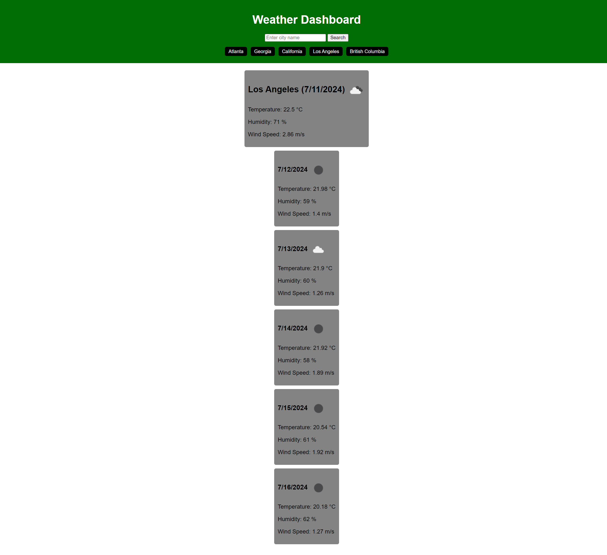

# Weather-Dashboard

## Description
A weather dashboard to help plan a trip accordingly. It provides the current dates weather as well as a 5-day forecast for any city in the world. 

## Installation
N/A

## Usage
In the search box, input any city name from around the world and click the search button. In the body of the page, the first box will show the current date's forecast. Just below that box in a column will show the 5-day forecast. Below the search box in the header will show all your recent city search history to make it easier to reference past searches. 

## Preview

[Click here to preview My Weather Dashboard website](https://rawnaqk.github.io/Weather-Dashboard/)

## Credits
N/A

## License
Please refer to the LICENSE in the repo.